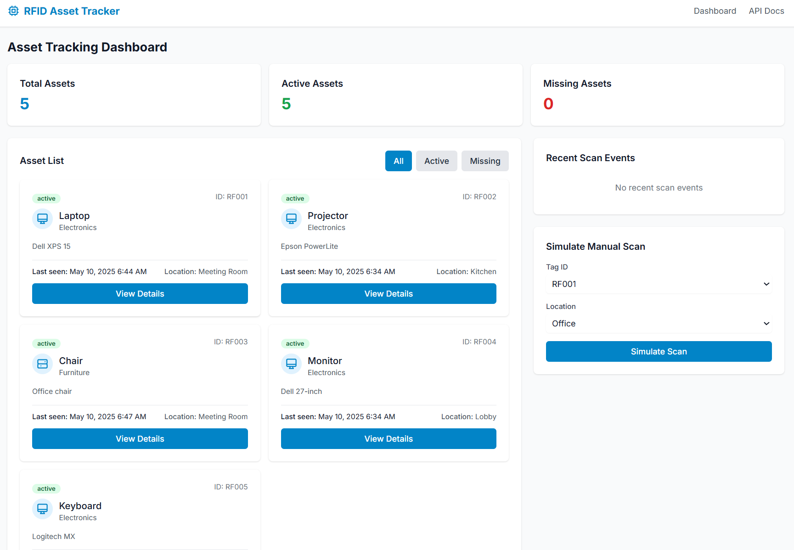
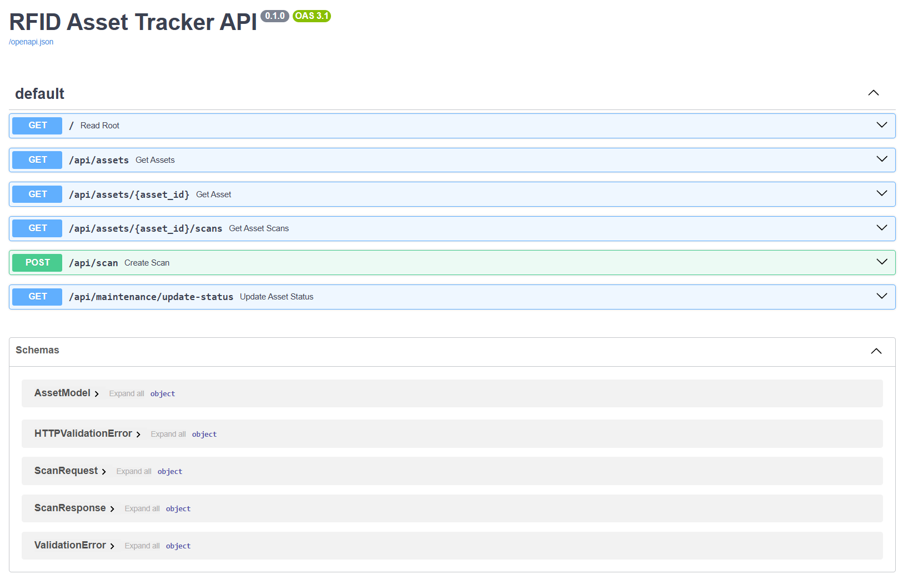

# RFID-Based Asset Tracker (MVP Simulation)

A fullstack RFID-based asset tracking system simulation built with FastAPI (Python backend) and Svelte (frontend). The system emulates real-time asset monitoring using mocked RFID scan data, providing a realistic demonstration of IoT workflows without hardware.

## Features

- **Real-time dashboard** showing mock RFID scan events
- **Filter assets** by status (active, missing, idle)
- **Responsive UI** with minimal, modern design using Tailwind CSS
- **REST API** to simulate RFID tag scans and asset movement
- **SQLite database** for lightweight persistence
- **Configurable environment** via JSON config file

## Screenshots

### Dashboard


*Real-time asset tracking dashboard with status filtering and scan simulation*

### API Documentation


*Built-in FastAPI Swagger documentation for easy API exploration*

## Setup Instructions (Windows)

### Backend Setup

1. Create and activate a virtual environment:
   ```
   python -m venv venv
   venv\Scripts\activate
   ```

2. Install dependencies:
   ```
   pip install -r requirements.txt
   ```

3. Run the FastAPI server:
   ```
   python api/main.py
   ```
   The server will start at http://localhost:8000

### Frontend Setup

1. Navigate to the frontend directory:
   ```
   cd frontend
   ```

2. Install Node.js dependencies:
   ```
   npm install --legacy-peer-deps
   ```

3. Start the Svelte development server:
   ```
   npm run dev
   ```
   The frontend will be available at http://localhost:5173

## Configuration

You can modify the behavior of the application by editing the `config.json` file:

```json
{
  "db_path": "data/assets.db",
  "port": 8000,
  "simulate_auto_scan": true,
  "scan_interval_seconds": 5
}
```

- `db_path`: Path to the SQLite database file
- `port`: Port for the FastAPI server
- `simulate_auto_scan`: Enable/disable automatic scan simulation
- `scan_interval_seconds`: Interval between automatic scans

## API Usage

### Example Mock Scan Request

Using curl:
```
curl -X POST "http://localhost:8000/api/scan" -H "Content-Type: application/json" -d "{\"tag_id\": \"RF001\", \"location\": \"Building A\"}"
```

The frontend also includes a button to trigger mock scans.

## Extending the Project

### Integration with Real RFID Hardware

To integrate with real RFID hardware, modify the `mock_data.py` file to connect with your RFID reader's API or SDK. The current simulation architecture is designed to be easily replaced with real hardware inputs.

### Machine Learning Integration

For predictive analytics, consider adding a ML pipeline that processes historical scan data to predict asset movements or detect anomalies in asset behavior. 